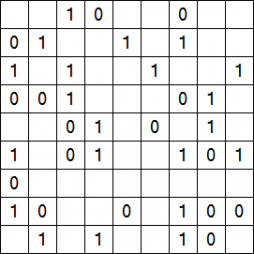

# Projet Takuzu

## Introduction

Bienvenue dans le projet Takuzu ! Le Takuzu est un jeu de logique passionnant dans l'esprit du Sudoku, mais avec une touche unique : vous ne travaillez qu'avec les chiffres 0 et 1. Le défi est de remplir une grille carrée en respectant les règles simples suivantes :

1. Dans une ligne, il doit y avoir autant de 0 que de 1.
2. Dans une colonne, il doit y avoir autant de 0 que de 1.
3. Il ne peut pas y avoir deux lignes identiques dans la grille.
4. Il ne peut pas y avoir deux colonnes identiques dans la grille.
5. Dans une ligne ou une colonne, il ne peut y avoir plus de deux 0 ou deux 1 à la suite (on ne peut pas avoir trois 0 de suite ou trois 1 de suite).

## Rapport du Projet

Ce README contient des informations essentielles sur le projet Takuzu.

### Préambule

Le Takuzu est un jeu de grilles dans l'esprit du Sudoku, mais les chiffres utilisés pour remplir une grille sont uniquement le 0 et le 1. Les règles du Takuzu sont extrêmement simples.

1. Dans une ligne, il doit y avoir autant de 0 que de 1.
2. Dans une colonne, il doit y avoir autant de 0 que de 1.
3. Il ne peut pas y avoir deux lignes identiques dans une grille.
4. Il ne peut pas y avoir deux colonnes identiques dans une grille.
5. Dans une ligne ou une colonne, il ne peut y avoir plus de deux 0 ou deux 1 à la suite (on ne peut pas avoir trois 0 de suite ou trois 1 de suite).

### Implémentation du jeu

Le projet Takuzu est implémenté en langage C. Voici les fichiers principaux :

- `main.c`: Exécution du menu de démarrage et possibilité de décommenter les tests.
- `plateau.c`: Toute l'implémentation logique du jeu Takuzu.
- `interface.c`: Gestion de l'interface utilisateur.
- `test.c`: Tests.

### Compilation

Pour compiler le projet, vous pouvez utiliser la commande suivante :
gcc main.c plateau.c interface.c test.c -o main.exe

### Utilisation

1. Exécutez le programme en utilisant `./main.exe`.
2. Suivez les instructions indiquées dans le terminal.

